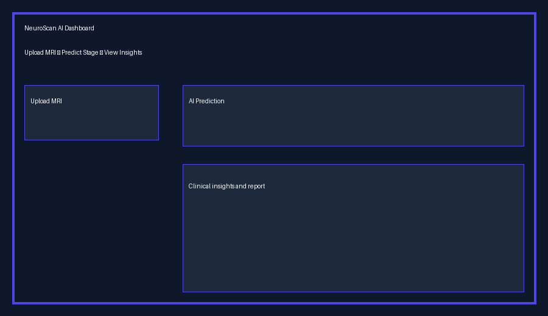
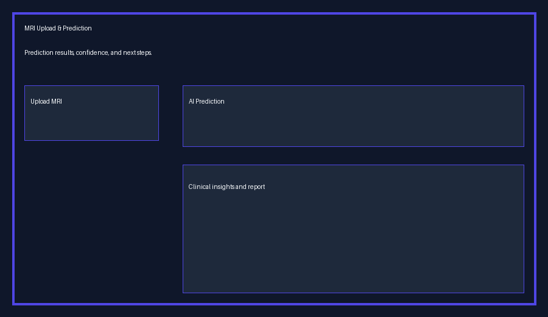
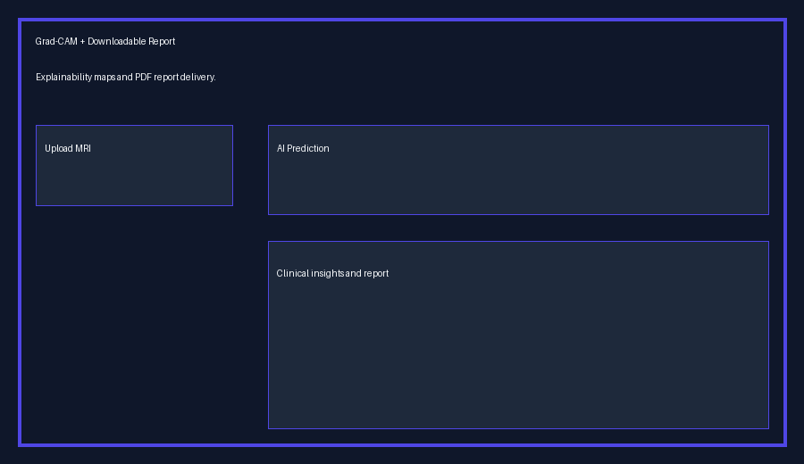

# 🧠 NeuroScan AI

**Explainable Alzheimer’s MRI Detection Platform with Clinical Reports and Visual AI**


[](https://github.com/bpriyanka-rao/Alzheimers-detection-main/actions/workflows/python-app.yml)

NeuroScan AI is a polished portfolio-grade healthcare intelligence project that detects Alzheimer’s progression from brain MRI scans, provides explainable heatmaps, and generates medical-grade PDF reports with clinical recommendations.

This project is crafted for a strong portfolio presentation and demonstrates:
- transfer learning on medical imaging data,
- explainable AI with Grad-CAM,
- end-to-end Flask deployment,
- automated report generation,
- a clean UX for clinical stakeholders.

---

## 🌟 What Makes This Project Major

- **Multiclass Alzheimer’s Detection**: Classifies MRI scans into four clinical stages.
- **Explainability**: Uses Grad-CAM to surface model reasoning and support human review.
- **Report Automation**: Generates structured PDF medical reports with predicted stage, confidence, and advice.
- **Clinical Insights Engine**: Creates stage-specific symptoms, care guidance, and precautions.
- **Full Web Application**: Upload interface, model inference, result pages, dashboard, and history tracking.
- **Portfolio Ready**: Includes professional README, visuals, deployment guidance, and a strong technical story.

---

## 🚀 Project Features

- MRI upload and prediction pipeline
- Four Alzheimer’s categories: Non-Demented, Very Mild, Mild, Moderate
- Grad-CAM image overlay for AI transparency
- Patient report generation via `FPDF`
- Responsive Flask web UI with dashboard and history pages
- Model fallback demo mode when trained weights are unavailable
- Training script for custom datasets and architecture extension
- Docker support and GitHub Actions CI configuration for professional delivery

---

## 📸 Screenshots

### Homepage & Dashboard


### Upload & Prediction Flow


### Grad-CAM and Report View


> Tip: Replace these placeholder visuals with real screenshots captured from the running app to make the project even more compelling.

---

## 🧩 Project Structure

```text
alzheimers-detection/
├── app/
│   └── app.py                  # Flask web app, routes, and report/email services
├── src/
│   ├── predict.py              # Inference and model prediction logic
│   ├── gradcam.py              # Grad-CAM explainability generator
│   ├── clinical_insights.py    # Rule-based Alzheimer’s care guidance
│   ├── pdf_report.py           # Medical PDF report builder
│   ├── preprocess.py           # MRI preprocessing and normalization
│   ├── train.py                # Model training and transfer learning pipeline
│   └── evaluate.py             # Model evaluation metrics and visualization helpers
├── templates/                  # Flask HTML templates for UI pages
├── static/                     # CSS, JavaScript, and uploads storage
├── screenshots/                # Screenshot assets for README
├── models/                     # Saved model weights and metadata
├── data/                       # Dataset storage for training and evaluation
├── .github/                    # GitHub Actions CI workflows
├── Dockerfile                  # Docker build instructions
├── CONTRIBUTING.md             # Contribution and development guide
├── LICENSE                     # Open source license
└── README.md                   # Project overview and documentation
```

---

## 🧠 Model Architecture

This project uses a transfer learning architecture based on **MobileNetV2**.
- **Backbone:** MobileNetV2 pre-trained on ImageNet
- **Input:** 224x224 RGB MRI frames
- **Output:** 4-class softmax probability vector
- **Explainability:** Grad-CAM heatmap overlays
- **Report mode:** outputs patient-friendly prediction summary and guidance

---

## 🧪 Local Setup

### Prerequisites
- Python 3.10 or 3.11
- Git
- A virtual environment is recommended

### Environment Variables
The app can optionally send email reports and chat with Gemini. Copy `.env.example` to `.env` and set these values, or set them directly in your shell environment:

- `GEMINI_API_KEY` — required for AI chatbot responses
- `MAIL_USERNAME` — SMTP sender email address
- `MAIL_PASSWORD` — SMTP sender password

### Install
```bash
git clone https://github.com/bpriyanka-rao/Alzheimers-detection-main.git
cd Alzheimers-detection-main
python -m venv .venv
.venv\Scripts\activate
pip install -r requirements.txt
```

### Run
```bash
python app/app.py
```
Open **http://localhost:5000** in your browser.

### Run with Docker
```bash
docker build -t neuroscan-ai .
docker run -p 5000:5000 neuroscan-ai
```

---

## 🧠 Training Your Own Model

1. Download and prepare an Alzheimer’s MRI dataset.
2. Place training images in `data/train` and validation/test images in `data/test`.
3. Run the training script:
```bash
python src/train.py --architecture mobilenetv2
```

> Demo dataset note: A sample `data/demo_cifar10` dataset has been generated for pipeline testing, and a demo model was saved to `models/alzheimer_model.h5` during the environment validation run.

> If no model file exists, the app will still run using demo simulation mode so the UI and dashboards remain visible.

---

## 📊 Evaluation & Metrics

The repository includes evaluation utilities for:
- accuracy and loss curves
- confusion matrix
- class-specific precision/recall
- validation performance reporting

Use `src/evaluate.py` to extend evaluation on your own dataset.

---

## 🚀 Deployment Ideas

This Flask app can be deployed to:
- Render
- Heroku
- DigitalOcean App Platform
- AWS Elastic Beanstalk
- Docker containers

A simple Dockerfile can containerize the app for production deployment.

---

## 📌 Repository & Interview Readiness

This project is prepared for GitHub presentation and technical review.
- `Dockerfile` for containerized deployment.
- GitHub Actions workflow for automated syntax and dependency validation.
- `CONTRIBUTING.md` and `LICENSE` for clean open-source readiness.
- `README.md` includes setup, training, deployment, and demonstration details.

To publish this repository:
```bash
git init
git add .
git commit -m "Professionalize NeuroScan AI healthcare project"
git branch -M main
git remote add origin https://github.com/bpriyanka-rao/Alzheimers-detection-main.git
git push -u origin main
```

---

## ✅ How to Make It Even Bigger

1. Add a **real trained model** under `models/` and document training results.
2. Capture real app screenshots and replace placeholder assets.
3. Add a **video demo** or GIF of the prediction flow.
4. Add a **data preprocessing notebook** showing dataset cleaning and augmentation.
5. Add a **model comparison section** with alternatives like EfficientNet or ResNet.
6. Add **unit tests** for preprocessing, prediction, and report generation.

---

## 📘 Notes

This project is built for demonstration and portfolio purposes only. It is not intended as a medical diagnosis tool.

---

## 📄 License

Use a permissive license if you want to publish this project publicly, such as MIT.
